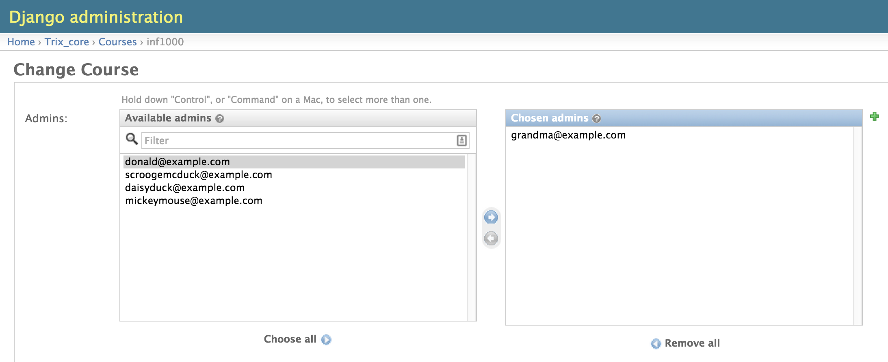

##############################
Add administrators to a course
##############################

The add administrators on a course you need to navigate to the correct course. This is described in the :ref:`administer-a-course`.
guide. Proceed with the steps outlined below.

The panel on the left list users eligible for admin access. Just mark a username by clicking on it [#tips]_
and click the arrow button to provide admin access.

The panel on the right side lists the current administrators. To deprive users their administrators rights just mark them
and click the arrow button pointing in the opposite direction.

When your administrator list is updated click the save button in the bottom right position of your browser window.

.. [#tips] A little trick: To mark several users hold in the shift or control button on your keyboard and click on the users.

