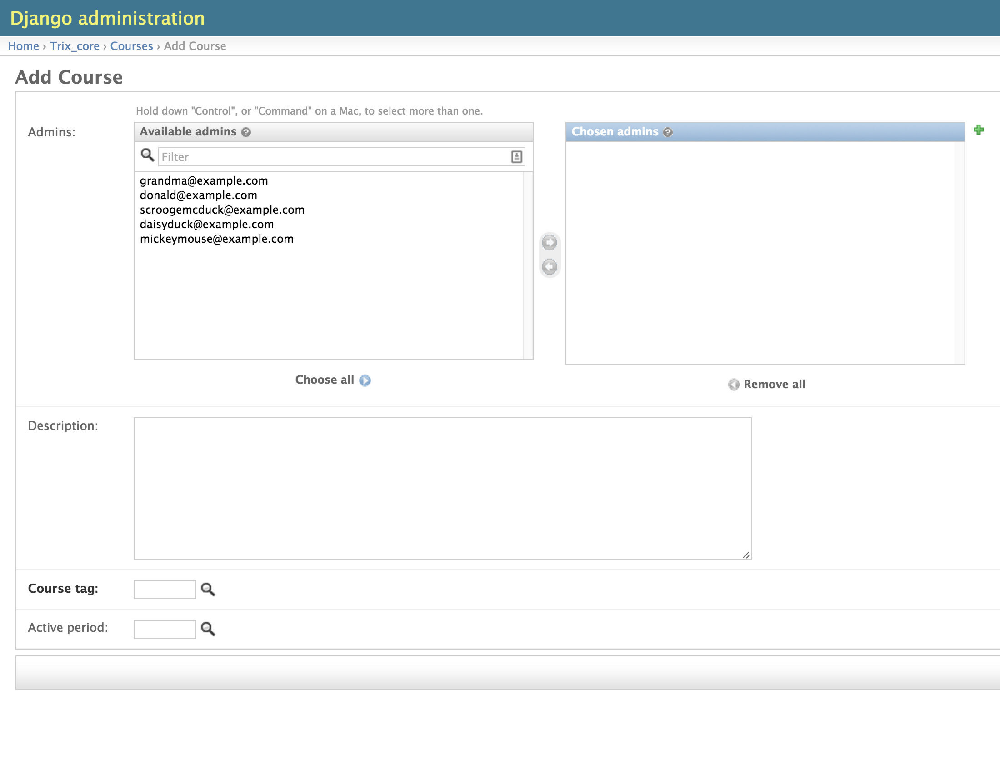
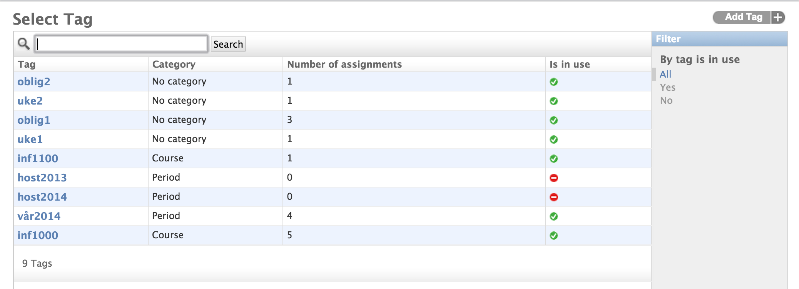
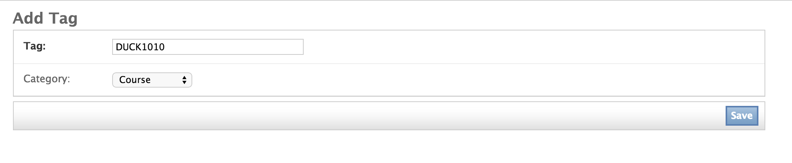
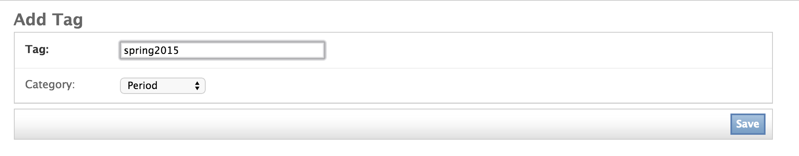

################
Add a new course
################

To add a new course you need to navigate to the course list view. This is described in the :ref:`administer-a-course`.
guide. Proceed with the steps outlined below.

In the upper right corner of the course list view click **Add Course**

First you may select the administrators of the course and type a description that briefly explaines the course. This text
is shown to the students when they access the course page.

Then set the correct course tag that are defining the course. Click the magnifier icon next to the **Course tag:** field

If you already have created a course tag choose and click the right one from the list. Make sure that the tag you are
using have the *Category* Course.

To create a new course tag click the **Add Tag** in the upper right corner.

Type the name and set the category to **Course** and click save.

Finally set the period tag by clicking the magnifier icon next to the **Active Period:** field.
Choose an existing tag if it's already defined otherwise click **Add Tag** and type the info.

Click save.