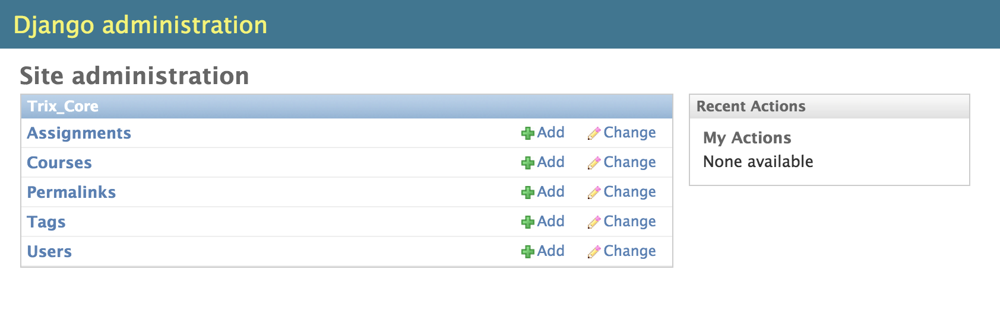
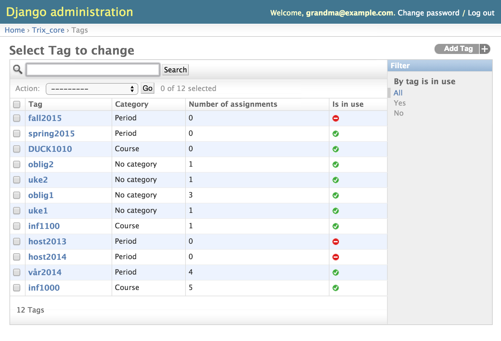

################
Add a new period
################

A period is implemented within the tag system. This means that a period is only a tag with a particular category.
In practice a course is defined by its course and period tag. Making it the default activated tags when the assignments
are presented to the students within the boundaries of a course. This is how trix have mirrored the real world course structure.

To add a new period tag click the **Tags** item in the list.

Click **Add Tag** in the upper right corner and then type the name of the tag along with the category *Period*

The newly added period tag can then be defined as the active period on a course.