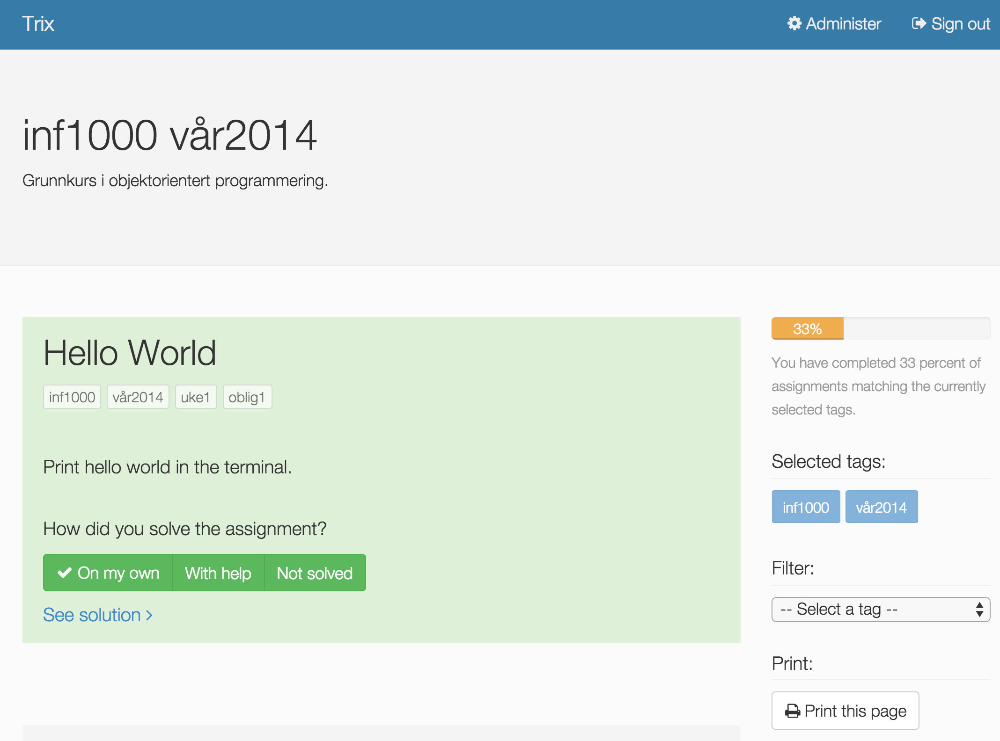

###############
Getting started
###############

As a student you may use the Trix system in two modes.

1. Anonymous
2. Authenticated

As an anonymous user you will be able to see the assignments and view their solutions. You will not be
able to track your progress.

If you log in you will be able to track your progress along with the status on how an assignment was solved.
An assigments may be marked as one of the following.

Not solved
    This is the default status, meaning that you have not marked the assignment.

With help
    You may mark an assigments as *With help* when you have solved it with the help of others or with extra hint and tricks

On my own
    An assignments should be marked *On my own* when you completed it all by yourself. This is the highest degree of verification that the subject
    is understandable for you.

The progress bar in the right side of the view tell in percentage how many of the selected assignments that have been solved on your own

The selected tags lists the active tags that define the selection of assigments

You may also filter the selection by selecting tags that will narrow the number of assignments listed to the set that have all the selected tags.
As an example a course is already defined by the authors with their *course* and *period* tags. Below this the authors may have marked a number of assignments with
the tags *week1* and some other assignments *week2*. You may then filter with these tags to focus on the correct assignments.

